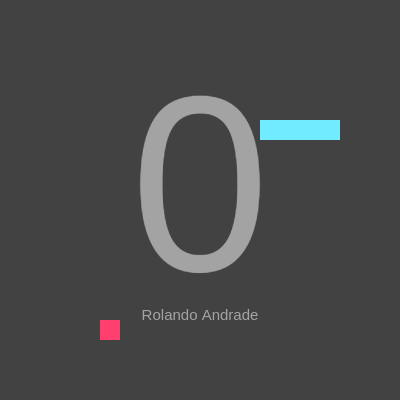

# Snake

> Snake HTML Canvas video game.



## About

Snake is a video game first released during the mid 1970s in arcades and has maintained popularity since then, becoming something of a classic.

## Requirements

For development, you will only need Node.js and a node global package, npm or yarn, installed in your environment.

## Install
```shell
$ git clone https://github.com/RolandoAndrade/snake.git
$ cd snake
$ npm install
```

## Running the project

```shell
$ npm run start
```

## Build for production

```shell
$ npm run build
```

## License
This project is [MIT License](https://github.com/RolandoAndrade/snake/blob/master/LICENSE)
licensed.
